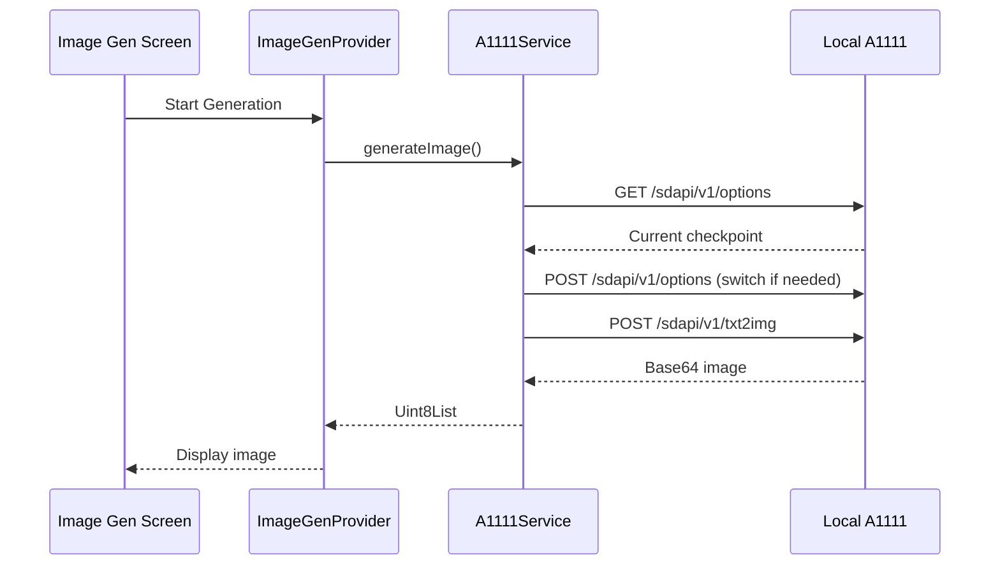
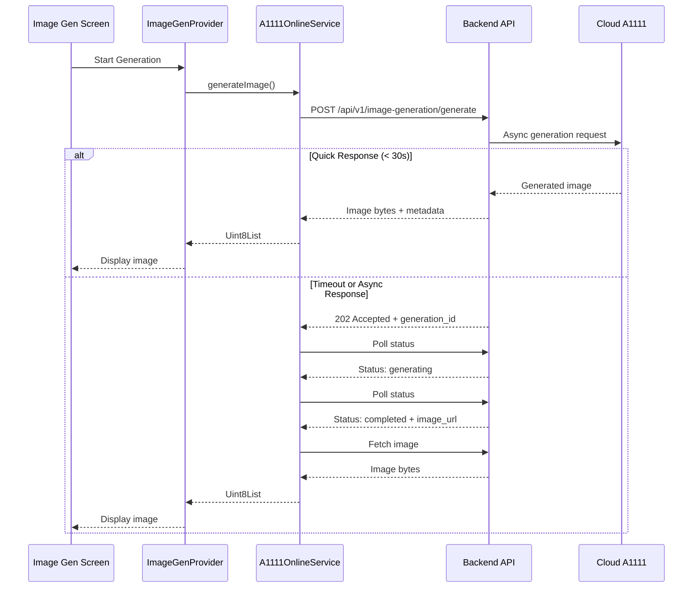

# A1111 Online Mode Support

## Architecture Overview

```mermaid
flowchart TD
    Settings[Settings Screen] -->|Configure| ModeSelection[A1111 Mode: Local/Online]
    ModeSelection -->|Local Mode| LocalFlow[Local A1111 Flow]
    ModeSelection -->|Online Mode| OnlineFlow[Online API Flow]
    
    LocalFlow -->|Direct Connection| LocalA1111[Local A1111 Instance]
    LocalFlow -->|Get Models| LocalModelsAPI[/sdapi/v1/sd-models]
    LocalFlow -->|Get LoRAs| LocalLorasAPI[/sdapi/v1/loras]
    LocalFlow -->|Get Checkpoint| LocalOptionsAPI[/sdapi/v1/options]
    LocalFlow -->|Generate| LocalGenerateAPI[/sdapi/v1/txt2img]
    
    OnlineFlow -->|Via Backend| BackendAPI[Backend API]
    BackendAPI -->|List Models| GetModelsEndpoint[GET /api/v1/image-generation/models]
    BackendAPI -->|Generate Image| GenerateEndpoint[POST /api/v1/image-generation/generate]
```

## Implementation Plan

### 1. Update Settings Provider ([lib/providers/settings_provider.dart](lib/providers/settings_provider.dart))

Add new state for A1111 mode selection:

- Add `A1111Mode` enum: `local`, `online`
- Add `_a1111Mode` field with getter/setter
- Load/save A1111 mode from/to SharedPreferences
- Default to `local` mode for backward compatibility

### 2. Update Settings Screen ([lib/screens/settings/settings_screen.dart](lib/screens/settings/settings_screen.dart))

In the A1111 backend configuration card (line ~660):

- Add dropdown selector for A1111 mode (Local/Online) at the top of the configuration
- When **Online mode** is selected:
  - Hide all local configuration fields: Start Command, Working Directory
  - Only show API Endpoint and Health Check Endpoint
  - Show info message: "Online mode uses backend API. Configure API Base URL in Backend API Configuration section."
- When **Local mode** is selected:
  - Show all existing fields (current behavior)

### 3. Create A1111 Online Service ([lib/services/a1111_online_service.dart](lib/services/a1111_online_service.dart))

New service to handle online A1111 operations using backend API:

**Key Methods:**

- `Future<List<A1111Model>> getAvailableModels()` - Fetch from `GET /api/v1/image-generation/models?provider=a1111`
- `Future<Uint8List> generateImage(GenerationRequest request)` - Call `POST /api/v1/image-generation/generate`
  - Initial loading spinner (30s timeout)
  - If timeout or async response, fall back to polling pattern
- Uses `ApiClient` for authentication and base URL configuration

**API Integration:**

- `/api/v1/image-generation/models`: Returns models with provider filter
- `/api/v1/image-generation/generate`: Accepts `ImageGenerationRequest` body with prompt, model, size, quality, etc.
- Both endpoints require JWT authentication (handled by ApiClient)

### 4. Update Image Generation Service ([lib/services/image_generation_services.dart](lib/services/image_generation_services.dart))

Modify `A1111ImageGenerationService` class (line ~920):

- Add constructor parameter for `A1111Mode`
- Add conditional logic:
  - **Local mode**: Use existing direct API calls (lines 984-1036)
  - **Online mode**: Delegate to `A1111OnlineService`
- In `getAvailableCheckpoints()`: 
  - Local: Call `/sdapi/v1/sd-models` directly
  - Online: Call backend `/api/v1/image-generation/models?provider=a1111`
- In `getAvailableLoras()`:
  - Local: Call `/sdapi/v1/loras` directly
  - Online: Keep same call (assume backend will implement soon)
- In `getCurrentCheckpoint()`:
  - Local: Call `/sdapi/v1/options` (lines 1040-1074)
  - Online: Not available, return null
- In `generateImage()`:
  - Local: Existing flow with checkpoint switching (lines 930-981)
  - Online: Use `A1111OnlineService.generateImage()` with hybrid approach

### 5. Update Image Generation Provider ([lib/providers/image_generation_provider.dart](lib/providers/image_generation_provider.dart))

Add mode awareness:

- Pass A1111 mode from `SettingsProvider` to `A1111ImageGenerationService`
- Update model refresh logic to handle both modes
- Hide checkpoint switching logic when in online mode
- Update error messages to reflect current mode

### 6. Update Image Generation Screen ([lib/screens/image_generation/image_generation_screen.dart](lib/screens/image_generation/image_generation_screen.dart))

Conditional UI based on A1111 mode:

- **Current Checkpoint Display** (lines 316-327): Only show in local mode
- **Model Selection Dropdown**: 
  - Local mode: Show A1111 checkpoints from direct API
  - Online mode: Show models from backend API
- **LoRA Selection**: Keep functional in both modes (backend will handle)
- **Status Messages**: Update to reflect online/local mode context

### 7. Update Models ([lib/models/image_generation_models.dart](lib/models/image_generation_models.dart))

Add new models for online API:

- `A1111Model` class for models returned by backend API
  - Fields: `name`, `provider`, `displayName`, `description`, `metadata`, `isActive`
- `ImageGenerationRequest` class for online generation request
  - Fields: `prompt`, `model`, `size`, `quality`, `outputFormat`, `outputCompression`, `n`

### 8. Update App Constants ([lib/utils/app_constants.dart](lib/utils/app_constants.dart))

Add A1111 mode constants:

- `A1111Mode` enum definition
- Default A1111 mode value

### 9. Update Settings Persistence ([lib/services/settings_persistence_service.dart](lib/services/settings_persistence_service.dart))

Add persistence for A1111 mode:

- Add `a1111Mode` field to `SettingsData` class
- Save/load A1111 mode to/from SharedPreferences

## Data Flow Diagrams

### Local Mode (Current Behavior)



### Online Mode (New)



## Testing Considerations

1. **Settings Persistence**: Verify A1111 mode saves/loads correctly
2. **Mode Switching**: Test switching between local and online modes
3. **Model Loading**: Verify models load correctly in both modes
4. **Generation Flow**: Test image generation in both modes
5. **Error Handling**: Test API errors, timeouts, authentication failures
6. **UI State**: Verify UI hides/shows appropriate fields based on mode

## Migration Notes

- Existing users default to **local mode** for backward compatibility
- No breaking changes to existing local A1111 functionality
- Online mode is opt-in via settings
- If backend API is not configured, online mode will show error prompting user to configure API Base URL