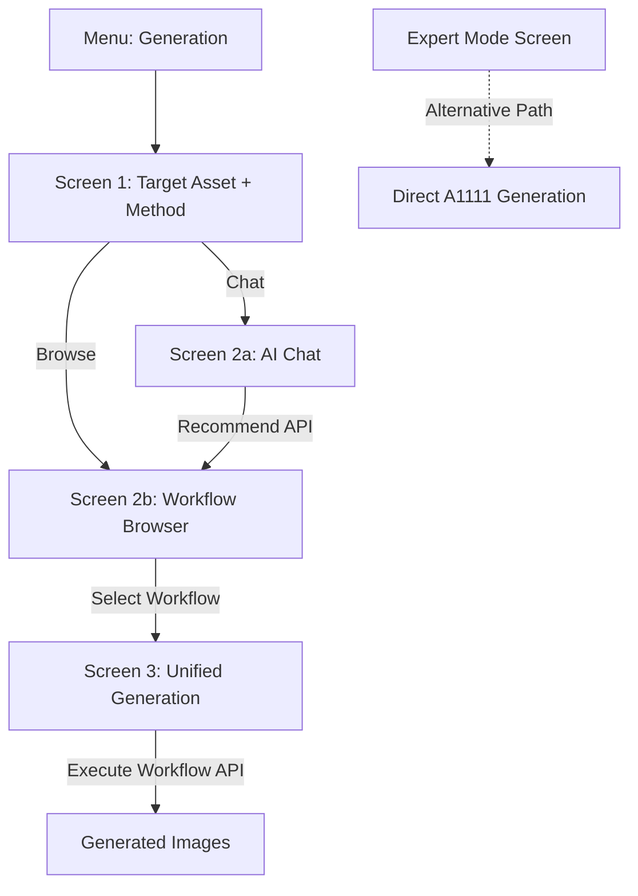

# Workflow-Based Image Generation Refactor

## Overview

Transform the image generation flow from a direct configuration approach to a workflow-based system where users either describe their needs via AI chat or browse a workflow gallery, then execute the selected workflow with their inputs.

## Architecture Flow

## Implementation Phases

### Phase 1: Foundation - Models, Services & Providers

**1.1 Create Workflow Models** (`lib/models/workflow_models.dart`)Based on the OpenAPI schema, create:

- `Workflow` class with fields: id, name, category, description, visibility, tags, sampleImages, isActive, defaultVersion
- `WorkflowVersion` class with: id, workflowId, version, model, promptAddition, promptDeletion, promptAiModificationPrompt, additionalConfig, isDefault
- `WorkflowListResponse`, `WorkflowRecommendRequest`, `WorkflowExecuteRequest` classes
- Factory methods from JSON for API response parsing

**1.2 Create Workflow API Service** (`lib/services/workflow_api_service.dart`)Implement API calls matching OpenAPI endpoints:

- `Future<List<Workflow>> listWorkflows({String? search, String? category, String? visibility, bool activeOnly})`
- `Future<Workflow> getWorkflow(String workflowId)`
- `Future<List<Workflow>> recommendWorkflows(String instruction, Map<String, dynamic> additionalInfo, int count)`
- `Future<ImageGeneration> executeWorkflow(String workflowId, String assetId, String prompt, {int? version, Map<String, dynamic>? configOverrides})`

Use existing `ApiClient` from [`lib/services/api_client.dart`](lib/services/api_client.dart) for HTTP calls.**1.3 Create Workflow Provider** (`lib/providers/workflow_provider.dart`)State management for workflows:

- Cache workflows list and selected workflow
- Methods: `loadWorkflows()`, `recommendWorkflows()`, `selectWorkflow()`, `executeWorkflow()`
- Notify listeners on state changes
- Handle loading/error states

### Phase 2: Extract Reusable Components

Extract components from [`lib/screens/image_generation/image_generation_screen.dart`](lib/screens/image_generation/image_generation_screen.dart) into `lib/screens/image_generation/shared_widgets/`:**2.1 Asset Selection Widget** (`asset_selection_widget.dart`)Extract lines 90-273 from `parameters_panel_widget.dart`:

- Asset dropdown with name/description
- "New Asset" button functionality
- Asset info display with icon
- Asset metadata view button

**2.2 Recent Generations Panel** (`recent_generations_widget.dart`)Already exists as [`recent_images_panel_widget.dart`](lib/screens/image_generation/widgets/recent_images_panel_widget.dart) - can be reused directly.**2.3 Prompts Input Widget** (`prompts_input_widget.dart`)Extract from [`prompts_panel_widget.dart`](lib/screens/image_generation/widgets/prompts_panel_widget.dart):

- Positive/negative prompt text fields
- AI prompt generation button
- Basic styling and layout

### Phase 3: New Screens Implementation

**3.1 Screen 1: Target Asset + How to Start** (`lib/screens/image_generation/workflow/select_target_screen.dart`)Layout structure:

- Top: Reuse `AssetSelectionWidget` from Phase 2.1
- Bottom: Two large cards side-by-side (or stacked on mobile)
- Left card: "Describe in Chat" with icon, description, button
- Right card: "Browse Workflow Library" with icon, description, button
- Both sections disabled (50% opacity) until asset selected
- Navigation: Push to Screen 2a or 2b based on selection

**3.2 Screen 2a: Chat Interface** (`lib/screens/image_generation/workflow/chat_workflow_screen.dart`)Layout:

- Header: Asset info bar (reuse component)
- Main: Large text input for user description
- Footer: Back button, Continue button
- On Continue:
- Call `/api/v1/workflows/recommend` with user's text as `instruction`
- Navigate to Screen 2b with recommended workflows

**3.3 Screen 2b: Workflow Browser** (`lib/screens/image_generation/workflow/workflow_browser_screen.dart`)Layout:

- Header: Asset info bar
- Title: "Choose a workflow" or "Recommended workflows" (if from chat)
- Grid/List of workflow cards showing:
- Name, description, sample image
- Tags as chips
- Selected state (border highlight)
- Footer: Back button, Continue button (enabled when workflow selected)
- On load:
- If navigated from Screen 1: call `/api/v1/workflows` to list all
- If navigated from Screen 2a: use passed workflow recommendations
- On Continue: Navigate to Screen 3 with selected workflow

**3.4 Screen 3: Unified Generation** (`lib/screens/image_generation/workflow/unified_generation_screen.dart`)Three-column layout (responsive for mobile):Column 1 - Info Panel:

- Asset info container (name, description from Screen 1)
- Workflow card (reuse design from Screen 2b)
- "[CHANGE]" button to go back to Screen 2b

Column 2 - Generation Panel:

- Positive prompt (multiline text field)
- Negative prompt (multiline text field)
- "Generate Prompt AI" button (calls `/api/v1/{project_id}/assets/generate-prompt`)
- Expandable "Advanced" section with:
- Width, Height (from existing components)
- Batch count (from existing components)
- "Generate" button
- Calls `/api/v1/workflows/{workflow_id}/execute` with:
    - `asset_id`, `prompt`, `version` (from workflow), optional `generation_config` overrides

Column 3 - Recent Generations:

- Reuse `RecentGenerationWidget` from existing implementation

### Phase 4: Integration & Navigation

**4.1 Update Menu Navigation**In main dashboard/menu controller:

- Keep "Generation" menu item
- Point to new `SelectTargetScreen` (Screen 1)
- Add hidden/dev menu item for "Expert Mode" pointing to renamed expert screen

**4.2 Asset Detail Integration**When "Generate Image" is clicked from asset detail dialog:

- Navigate to `SelectTargetScreen` with asset pre-selected
- Skip asset selection, show method choice cards active

### Phase 5: Rename & Relocate Expert Mode

**5.1 Rename Current Screen**

- Rename [`lib/screens/image_generation/image_generation_screen.dart`](lib/screens/image_generation/image_generation_screen.dart) to `lib/screens/image_generation/expert/expert_generation_screen.dart`
- Update class name from `ImageGenerationScreen` to `ExpertGenerationScreen`
- Keep all existing functionality intact

**5.2 Move Expert-Specific Widgets**Move to `lib/screens/image_generation/expert/widgets/`:

- `parameters_panel_widget.dart` (expert mode specific)
- `header_widget.dart` (may need to extract reusable parts)
- `chat_panel_widget.dart` (expert mode specific)

## Key Files to Create

New files:

- `lib/models/workflow_models.dart`
- `lib/services/workflow_api_service.dart`
- `lib/providers/workflow_provider.dart`
- `lib/screens/image_generation/shared_widgets/asset_selection_widget.dart`
- `lib/screens/image_generation/shared_widgets/prompts_input_widget.dart`
- `lib/screens/image_generation/workflow/select_target_screen.dart`
- `lib/screens/image_generation/workflow/chat_workflow_screen.dart`
- `lib/screens/image_generation/workflow/workflow_browser_screen.dart`
- `lib/screens/image_generation/workflow/unified_generation_screen.dart`

Files to modify:

- Rename `image_generation_screen.dart` to `expert/expert_generation_screen.dart`
- Update navigation in menu controller
- Update imports throughout codebase

Files to reuse:

- [`lib/screens/image_generation/widgets/recent_images_panel_widget.dart`](lib/screens/image_generation/widgets/recent_images_panel_widget.dart)
- [`lib/screens/image_generation/widgets/prompts_panel_widget.dart`](lib/screens/image_generation/widgets/prompts_panel_widget.dart) (extract parts)
- [`lib/screens/image_generation/utils/dialog_helpers.dart`](lib/screens/image_generation/utils/dialog_helpers.dart) (for create asset dialog)

## Testing Considerations

- Test navigation flow: Screen 1 → 2a → 2b → 3
- Test navigation flow: Screen 1 → 2b → 3
- Test with pre-selected asset from asset detail
- Test workflow recommendation API
- Test workflow execution API